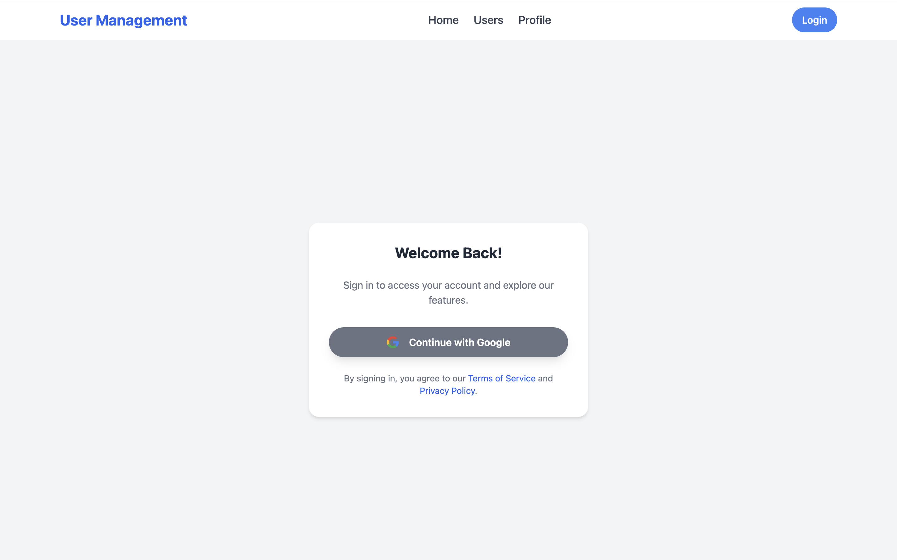

# SpringBoot-with-Google-Auth-SQL
# User Management System

A modern user management application built using **Spring Boot**, **React**, and other cutting-edge technologies. This project enables seamless user authentication, profile management, and data handling, leveraging the power of OAuth2, SQL databases, and a responsive front-end.

## Features

- User authentication using Google OAuth2.
- Save user details in sql db.
- Responsive UI built with React and Tailwind CSS.
- Real-time user details fetched from the backend.
- Seamless integration between front-end and back-end.

---

## Technologies Used

### Backend

- **Spring Boot**: A Java-based framework for building scalable, production-ready applications with minimal boilerplate.
  - Includes features like Dependency Injection, RESTful APIs, and integration with OAuth2 for authentication.
- **OAuth2**: Used for secure user authentication via Google.
  - Ensures secure login and authorization using third-party credentials.
- **SQL Database (MySQL/PostgreSQL)**:
  - Stores user details such as name, email, and profile photo.
  - Utilizes JPA (Java Persistence API) for seamless database interactions.
- **Spring Security**: Protects the application by enforcing authentication and authorization.

### Frontend

- **React**: A JavaScript library for building interactive user interfaces.
  - Utilized for creating a dynamic and responsive single-page application (SPA).
- **Tailwind CSS**: A utility-first CSS framework for designing a modern and responsive UI.
- **Axios**: For making HTTP requests between the React app and the Spring Boot API.

## Screenshots

    
    
  
   

 
